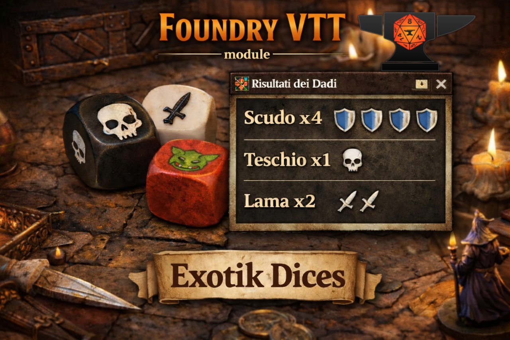

# Exotik Dices

A [Foundry VTT](https://foundryvtt.com/) module that adds fully customizable exotic dice with [Dice So Nice!](https://gitlab.com/riccisi/foundryvtt-dice-so-nice) integration, where exotic means with symbols/images.

Almost all of the code was written by AI — not because I couldn’t write it myself or because I particularly enjoy using these tools, but simply because it would have taken time I didn’t have. Otherwise, this module wouldn’t exist at all.

Basically, without AI I wouldn’t have had the time to develop it the old-school way, especially since I’m not a JavaScript developer and it would’ve taken me a bit longer…

That said, the structure, organization, integrations, and the setup for future development were all guided by me — as well as, of course, all the features it currently has.

## Features

- **Custom Dice** – Create dice with any number of faces (d4, d6, d8, d10, d12, d20) and assign custom textures, bump maps, and chat icons to each face.
- **Custom 3D Geometries** – Use rounded or stylized 3D shapes (GLB format) instead of default DSN geometry. Only available for face counts that have at least one custom geometry file.
- **Face References** – Configure a face to inherit all assets from another face, keeping the configuration DRY. Changes to the master face are reflected automatically in all referencing faces.
- **Chat Summary** – Roll results are displayed in chat with graphical icons and grouped counts instead of plain numbers.
- **Dynamic Configuration** – Manage your dice directly from Game Settings without opening a separate window. Edit, delete, or add dice with a form-based editor.

## Installation

1. In Foundry VTT, go to **Add-on Modules → Install Module**.
2. Paste the manifest URL:
   ```
   https://github.com/Nikoh77/exotik-dices/releases/latest/download/module.json
   ```
3. Click **Install**, then enable the module in your world.

## Requirements

- **Foundry VTT** v13+
- **Dice So Nice!** module (required dependency)

## Usage

### Rolling Dice

Each custom dice is assigned a single-character denomination (e.g. `h`). Roll it with:
```
/r 1dh        (roll one combat dice)
/r 3dh        (roll three combat dice)
/r 2dh + 1d6  (mix with standard dice)
```

### Configuring Dice

1. Go to **Game Settings** (gear icon).
2. Select **Exotik Dices** in the module list.
3. The right panel shows all defined dice with Edit/Delete buttons.
4. Click **Add Dice** to create a new one, or the pencil icon to edit.
5. In the editor, configure:
   - **Name** – Display name for the dice.
   - **Denomination** – Single character for roll formulas (must be unique).
   - **Faces** – Number of faces (4, 6, 8, 10, 12, 20).
   - **Geometry** – 3D shape (only shown when custom geometries exist for the face count).
   - **Face Configuration** – For each face, set a label, 3D texture, bump map, and chat icon. Optionally reference another face to inherit its assets.
6. Click **Save** and reload the world when prompted.

### Asset Folders

You can choose where to save your dice;w hen you save a dice, the module automatically creates folders:
```
path-you-have-chosen/exotik-dices/assets/dices/<dice_slug>/
    textures/    → 3D face textures (PNG)
    bump_maps/   → 3D bump maps (PNG)
    chat_2d/     → Chat icons (SVG/PNG)
```

### Custom Geometries

Place `.glb` files in `modules/exotik-dices/assets/geometries/`. Name them using the convention `<name>_d<N>.glb` where `N` is the face count. Example: `rounded_d6.glb` is a rounded geometry for 6-sided dice.

The module scans this folder and shows available geometries in the editor when applicable.

## Included Dice

The module ships with a **Come quando fuori piove** (`dh`), this is a dummy dice featuring:

- 2× Hearts faces
- 2× clubs faces
- 1× diamonds face
- 1× spades face

With a rounded "Board Game Classic" 3D geometry.

## License

MIT

## Credits

- **Author**: [Nikoh](https://github.com/Nikoh77)
- **great helper** [Claude AI](https://claude.ai)
- **Dice So Nice!**: [Simone](https://gitlab.com/riccisi/foundryvtt-dice-so-nice)
